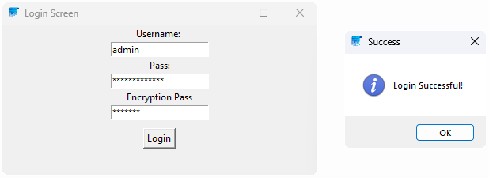
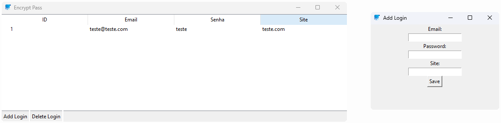

# ENCRYPT PASS

## How it's work:
  The purpose of this software is to help people store their passwords and logins from various platforms.
  
  But isn't it useless if I use one password for everything and just memorize it?
  
  Then you'll be vulnerable to anyone who discovers the password from just one place, potentially accessing all the others.
  That's where this software will help you, allowing you to create a different password for each website/application and save them so you don't lose them.
##

## Windows:

##

|          IDEAS         | UPDATES |
|------------------------|---------| 
|        make exe        |   Soon  |
| Implement cryptography |   Soon  |
##